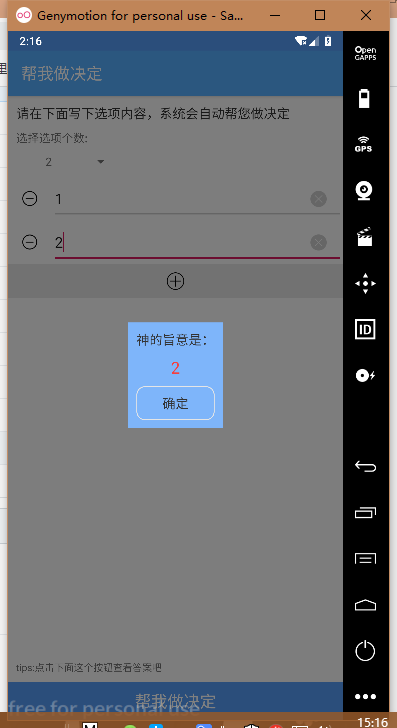
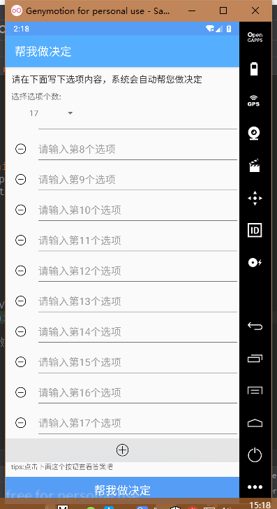

# （做事不可半途而废）帮我做决定
### 使用方法: 
1. 写上参与者名字 
2. 点击 开始抽奖

--------------------------
- 目前有个小bug 不显示结果，没有结果出来时，多点击几次 开始抽奖就ok了 
- android萌新 多多见谅

--------------------------
# 更新日志：
- 因本人重新开始学习JAVA，该项目彻底废弃，不再维护

- 改名为： 帮我做决定 更新界面ui 添加使用的文字描述 
- bug 待解决
- 2020/1/29 本来只想写个小工具练练手，谁知bug太多修复起来代价太大，本项目暂时废弃 
- 2020/2/3 再次开始完善 添加了 spinner 下拉列表 批量生成输入框
# 截图：
-   

-  
------------------------
# android apk 下载地址： [点这里](http://d.7short.com/myottery)